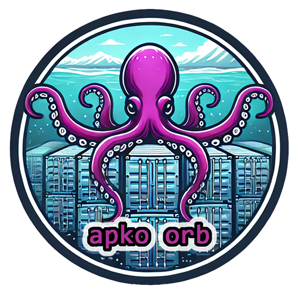

  
  <h1>CircleCI Apko Orb</h1>
  <i>An orb for simplifying Apko installation and use within CircleCI.</i>  

   

This is an unofficial Apko orb used for installing Apko in your CircleCI pipeline to build distroless container images. Contributions are welcome!

## Features
### **Secure By Design**
- **Least Privilege**: Installs to a user-owned directory by default, with no `sudo` usage anywhere in this orb.
- **Integrity**: Checksum validation of all downloaded binaries using SHA-512.
- **Provenance**: Installs directly from Apko's official [releases page](https://github.com/chainguard-dev/apko/releases/) on GitHub. No third-party websites, domains, or proxies are used.
- **Confidentiality**: All secrets and environment variables are handled in accordance with CircleCI's [security recommendations](https://circleci.com/docs/security-recommendations/) and [best practices](https://circleci.com/docs/orbs-best-practices/).
- **Privacy**: No usage data of any kind is collected or shipped back to the orb developer.
